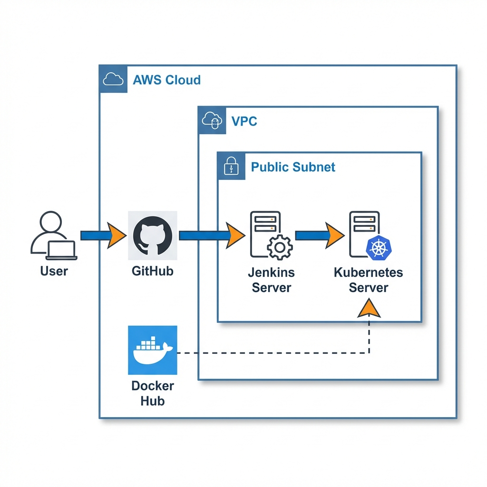
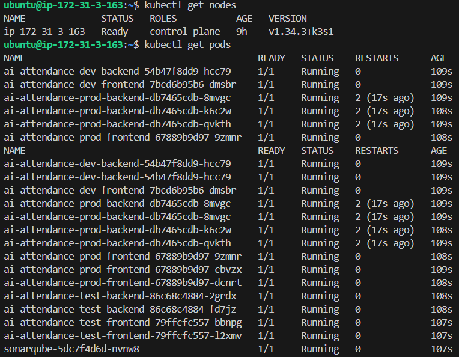
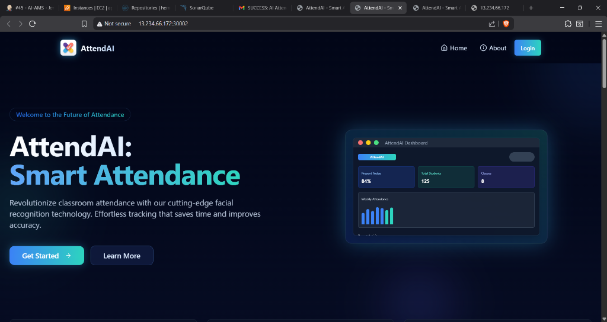
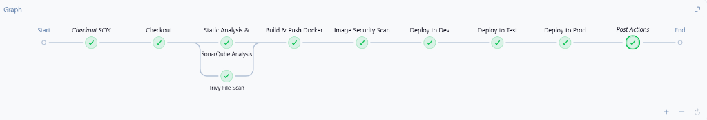
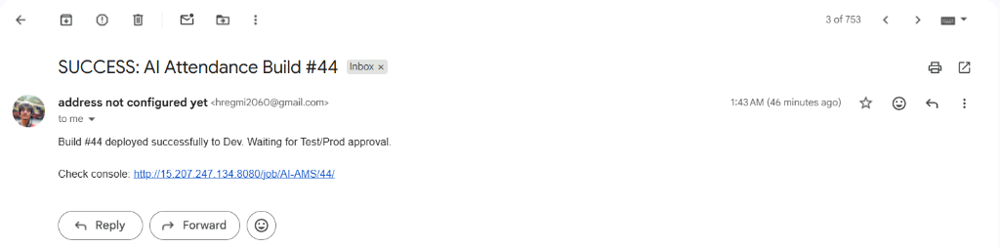
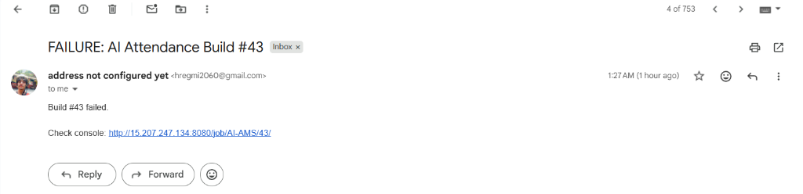
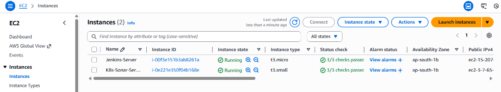
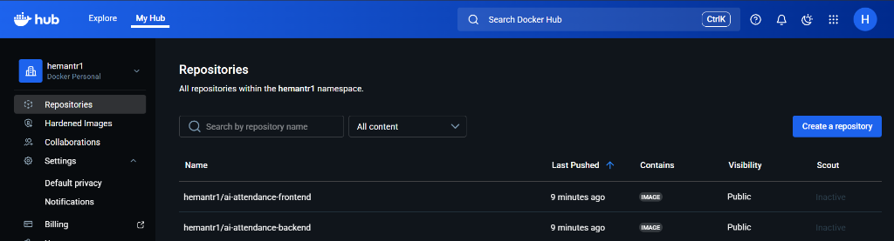

# AI Attendance Management System

**AttendAI: The Future of Smart Attendance**

AttendAI is a modern, full-stack web application designed to revolutionize classroom attendance tracking through facial recognition technology. Built with a scalable microservices architecture, it leverages Kubernetes for orchestration, Jenkins for CI/CD automation, and AWS for robust cloud infrastructure.

## 🏗️ System Architecture

The system is deployed on AWS using a highly available architecture involving a Virtual Private Cloud (VPC), Jenkins for build automation, and a K3s Kubernetes cluster for application hosting.



### Key Components
*   **Frontend**: React.js application offering an intuitive dashboard for teachers and students.
*   **Backend**: FastAPI (Python) service handling business logic and facial recognition processing.
*   **Database**: PostgreSQL for robust data persistence.
*   **Infrastructure**: AWS EC2 instances managed via Terraform.
*   **Orchestration**: K3s (Lightweight Kubernetes) for managing containerized microservices.
*   **CI/CD**: Jenkins pipeline automating build, test, security scans (SonarQube, Trivy), and deployment.

---

## 🚀 Deployment Status

The application is successfully deployed and running in the production environment. All microservices are active across Dev, Test, and Prod namespaces.

**Live System Verification:**


### Application Dashboard
The user interface provides real-time insights into student attendance.


### CI/CD Pipeline
Our robust Jenkins pipeline ensures every commit is automatically built, scanned, and deployed.


#### Email Notifications
The system provides instant feedback on build success or failure via email.



---

## 🛠️ Infrastructure Overview

The underlying infrastructure is fully automated using Terraform and runs on AWS EC2 instances.

### AWS Management Console
Two key instances power the system:
1.  **Jenkins-Server**: Handles all build and deployment tasks.
2.  **K8s-Sonar-Server**: Hosts the Kubernetes cluster and SonarQube quality gate.



### Docker Registry
Container images are versioned and stored securely in Docker Hub.


---

## 📋 Features
*   **Automated Tracking**: Eliminates manual roll calls using AI/ML.
*   **Real-time Analytics**: Instant visibility into attendance trends.
*   **Secure**: Role-based access control and encrypted data transmission.
*   **Scalable**: Designed to handle growing student and class numbers effortlessly.

## 🔧 Setup & Installation

### Prerequisites
*   AWS Account
*   Terraform installed
*   Docker & Kubernetes (kubectl)

### Quick Start
1.  **Clone the repository**:
    ```bash
    git clone https://github.com/hemantr1/AI-Attendance-Management-System.git
    ```
2.  **Provision Infrastructure**:
    ```bash
    cd terraform
    terraform init
    terraform apply --auto-approve
    ```
3.  **Deploy Application**:
    The Jenkins pipeline will automatically trigger upon push, handling the deployment to the Kubernetes cluster.

---

